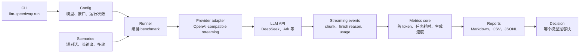

<p align="center">
  
</p>

# llm-speedway

**找到真正让 Agent 变快的 LLM API：首 token、任务耗时、生成速度，一份报告讲清楚。**

<p>
  <a href="README.md">English</a>
  |
  <a href="results/README.md">Benchmarks</a>
  |
  <a href="configs">Configs</a>
</p>


Agent 的慢，往往不是抽象的慢，而是让用户长时间盯着空白界面。

`llm-speedway` benchmark 的正是这部分体验：模型多久开始输出、一个固定任务多久完成、开始输出后写得有多快。它不是把一堆指标倒进表格，而是生成一份能直接帮助你选模型的报告。

## 它是什么

`llm-speedway` 是一个本地运行的 OpenAI-compatible Chat Completions API 测速工具。

它会发送受控 prompt，监听 streaming 响应，记录首 token 时间，确认接口确实返回了可见 assistant 文本，然后写出：

```text
results/<model>/
  report.md          # 给人看的报告
  summary.csv        # 三个核心指标
  raw_results.jsonl  # 完整请求级数据
```

除了你配置的 API endpoint，数据不会发往其他地方。

## 三个数字

| 指标 | 含义 | 为什么重要 |
|---|---|---|
| **First token** | 第一个可见 assistant token 到达的时间 | 用户不再盯着空白界面 |
| **Task time** | 固定场景 prompt 的端到端完成时间 | 产品工作流什么时候结束 |
| **Output speed** | 首 token 之后的 tokens/s | 模型持续生成能力 |

### 关于 “Task time”

Task time 不是一个跨所有 prompt 通用的模型速度分。

回复长度确实会变，所以 `llm-speedway` 把它定义成**场景级产品指标**：只在相同 prompt、相同模型参数、相同输出上限、相同 provider 路径下比较。想看归一化后的生成能力，看 **Output speed**。想看用户体感响应，看 **First token**。

这就是项目要讲清楚的事：Agent UX 不是一个数字。

## 测试场景

内置场景很少，因为每一个都对应一个真实 Agent 痛点。

| 场景 | 测什么 |
|---|---|
| `short_chat` | 轻量问答的等待感：它开始得快不快 |
| `long_generation` | 长输出的持续生成速度：它写起来快不快 |
| `multi_turn` | 上下文变长后的退化：对话重了以后会怎样 |

这三类覆盖了 Agent 常见的速度问题：开头慢、写得慢、多轮后变慢。

## 安装

本地安装：

```powershell
pip install -e .
```

也可以直接运行测试：

```powershell
python -m unittest discover -s tests
```

不依赖 OpenAI SDK。OpenAI-compatible adapter 使用 Python 标准库实现。

## 快速开始

复制配置：

```powershell
Copy-Item configs/config.example.json config.json
```

推荐用环境变量放 API key：

```json
{
  "api": {
    "base_url": "https://api.example.com/v1",
    "api_key_env": "LLM_API_KEY",
    "model": "model-name"
  }
}
```

运行：

```powershell
llm-speedway run --config config.json
```

只跑一个场景：

```powershell
llm-speedway run --config config.json --scenario short_chat --runs 3
```

## Benchmark

已提交的小样本报告在 [results](results/README.md)。

| 模型 | 短对话首 token | 长输出生成速度 | 多轮 |
|---|---:|---:|---|
| `deepseek-v4-flash` | 6.33s | 97.6 tok/s | 成功 |
| `doubao-seed-2.0-code` | 15.31s | 105.1 tok/s | 成功 |
| `glm-5.1` | 24.56s | 76.5 tok/s | 第 1 轮失败 |
| `kimi-k2.6` | 11.88s | 68.3 tok/s | 第 1 轮无可见输出 |

这些是第一轮筛选报告，不是严格统计结论。如果需要更稳的数字，提高 `runs_per_scenario`。

## 技术架构



运行链路很直接：配置和场景进入 runner；provider adapter 调用 API；streaming 事件进入指标层；报告把指标变成模型选择依据。

代码目录也按同样的边界组织：

```text
llm_latency_benchmark/
  cli.py                  # 命令入口
  runner.py               # benchmark 编排
  core/                   # 配置、指标、token 估算
  providers/              # API 协议适配
  scenarios/              # 测试 prompt 套件
  reports/                # Markdown / CSV / JSONL 输出
configs/                  # 可复用 provider 配置
tests/                    # 指标与汇总测试
results/                  # 已提交的 benchmark 报告
assets/                   # logo 与 README 素材
```

为什么这样拆：

| 层 | 职责 |
|---|---|
| `core/` | 配置解析、指标计算、token 估算 |
| `providers/` | API 协议适配；当前支持 OpenAI-compatible Chat API |
| `scenarios/` | prompt 套件与对话形态 |
| `reports/` | Markdown 和 CSV 输出 |
| `runner.py` | 串联 provider、scenario、metrics、report |

新增 provider 不应该动指标。新增场景不应该动 HTTP。改报告不应该重写原始数据。

## 数据模型

每次请求都会生成一条原始记录：

```json
{
  "scenario": "short_chat",
  "model": "deepseek-v4-flash",
  "success": true,
  "ttft_ms": 6330.12,
  "total_latency_ms": 7050.44,
  "decode_tps": 219.8,
  "finish_reason": "stop"
}
```

报告只提升三个字段：

- `ttft_ms` -> First token
- `total_latency_ms` -> Task time
- `decode_tps` -> Output speed

如果 streaming 响应没有任何可见 assistant 内容，这个样本会失败。空回答不应该拥有漂亮数字。

## Roadmap

- Anthropic-compatible provider adapter
- 并发 Agent load 模式
- provider-specific streaming normalization
- 外部 scenario 文件
- HTML 报告导出

## 原则

Fast token matters.

如果 Agent 注定需要时间，它至少应该先开始说话。
