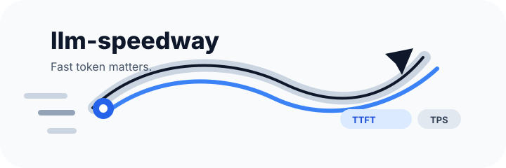
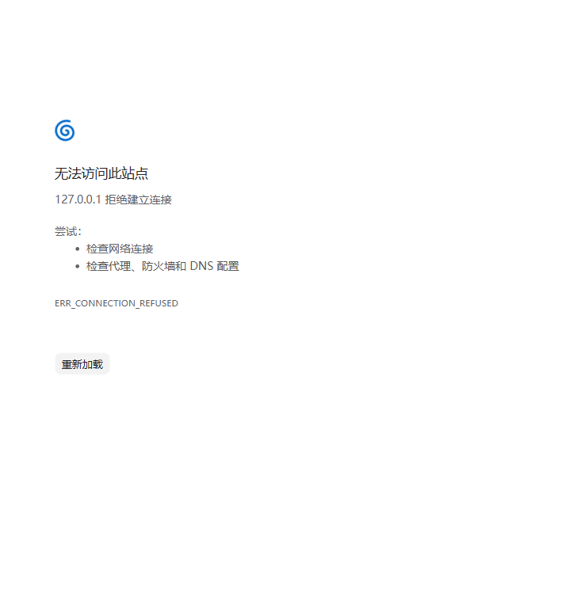

<p align="left">
  <a href="README.md">English</a>
</p>

<p align="center">
  
</p>

<p align="center">
  <strong>Agent 一沉默，时间就开始烧。</strong>
</p>

<p align="center">
  <strong>Token 快，体验才快。</strong>
</p>

# llm-speedway

**测量 LLM API 的真实体感：延迟、吞吐、多轮响应**

<p>
  <a href="v1/results/README.md">Benchmarks</a>
  |
  <a href="v1/docs/source-walkthrough.zh-CN.md">源码导读</a>
  |
  <a href="v1/configs">V1 配置</a>
  |
  <a href="v2/docs/prd-v2-cross-platform.zh-CN.md">V2 PRD</a>
</p>

Agent 沉默了，剩下的是漫长的等待。

在 agent 场景里，API 的每一点延迟都会被放大。工具调用、失败重试、多轮上下文，都会把模型速度变成真实的等待时间。`llm-speedway` 测的不是漂亮参数，而是 agent 体验真正会卡住的地方：首 token 出得快不快，后续吐字够不够猛，上下文变长以后还能不能稳。

V2 是 Tauri 桌面应用。加 provider，跑测速，看对比，所有结果都留在本地。



## 安装

### 推荐方式：GitHub Releases

去 [GitHub Releases](https://github.com/YuXiang-ZhuanSun/llm-speedway/releases) 下载对应系统的安装包。

预期发布文件：

| 平台 | 文件 | 使用方式 |
|---|---|---|
| Windows | `.msi` 或 `.exe` | 安装后启动 `llm-speedway` |
| macOS | `.dmg` | 打开 DMG 后启动应用 |
| Linux | `.AppImage` 或 `.deb` | 直接运行 AppImage，或安装 deb 包 |

如果 release 页面暂时没有你的平台包，就从源码启动。

### 源码安装

先准备：

- Node.js 20+
- Rust stable
- 当前系统对应的 Tauri 构建依赖

Windows 还需要安装 Visual Studio Build Tools，并启用 C++ workload。

```bash
git clone https://github.com/YuXiang-ZhuanSun/llm-speedway.git
cd llm-speedway/v2
npm ci
npm run desktop:dev
```

本地打包：

```bash
npm run desktop:build
```

安装包会生成在 `v2/src-tauri/target/**/release/bundle/`。

## 快速开始

1. 打开 `llm-speedway`。
2. 点击 **Add config**。
3. 填 provider 名称、base URL、模型、API key 和 API 格式。
4. 选择 `OpenAI compatible` 或 `Anthropic compatible`。
5. 点击 **Speedtest**。
6. 看首 token 延迟、生成吞吐、多轮响应和成功率。

错 key、错模型、假 API、错 endpoint，都会按真实失败记录。`llm-speedway` 不造数。

## 测量指标

| 指标 | 字段 | 含义 |
|---|---|---|
| 首 token 延迟 | `ttft_ms` | 第一段可见 assistant 内容多久出现 |
| 生成吞吐 | `decode_tps` | 首 token 之后的估算 tokens/s |
| 多轮生成吞吐 | `multi_turn_decode_tps` | 上下文堆起来之后还能跑多快 |

## API 格式

OpenAI-compatible API：

```text
POST /chat/completions
Authorization: Bearer <API_KEY>
```

Anthropic-compatible API：

```text
POST /v1/messages
x-api-key: <API_KEY>
anthropic-version: 2023-06-01
```

## V2 技术架构

```text
React + TypeScript UI
        |
        | Tauri IPC
        v
Rust commands
        |
        v
Services -> SQLite -> Speedtest HTTP streaming
```

V2 是正经本地桌面 benchmark，不是给脚本套一层浏览器壳。

| 层 | 技术职责 | 为什么重要 |
|---|---|---|
| React + TypeScript | 桌面 UI、provider 表单、结果表格、对比视图 | 测速流程清楚，结果一眼能扫 |
| Tauri IPC | 连接前端 UI 和 Rust 原生命令，不需要本地 HTTP 服务 | 少掉 CORS 麻烦，也更像一个真正的桌面产品 |
| Rust commands | 暴露 provider 管理、测速等 typed app actions | 前端只接触一层小而稳定的接口 |
| Rust services | 处理 provider 逻辑、真实 streaming 请求、计时采集和结果归一化 | 测真实 API 行为，不做假数据，也不靠估算糊过去 |
| SQLite | 本地保存配置、测速历史和结果 | 方便复测、对比，也不用把数据交给额外服务 |

测速走的是本地原生链路：

```text
用户点击 Speedtest
        |
        v
Tauri command
        |
        v
Rust speedtest service
        |
        v
OpenAI / Anthropic compatible streaming API
        |
        v
Timing metrics -> SQLite -> UI comparison table
```

这套架构盯的是 agent 体验里最要命的细节：第一段可见 token 什么时候来，streaming 后面吐得有多快，响应是不是真的产出了 assistant 文本，多轮上下文变长后速度还稳不稳。

本地数据在：

```text
~/.llm-speedway/llm-speedway.db
```

项目结构：

```text
v1/        # 原始 Python CLI benchmark runner
v2/        # Tauri + React + Rust 桌面应用
```

## 开发

```bash
cd v2
npm ci
npm run build
npm run desktop:dev
```

Rust 校验：

```bash
cd v2/src-tauri
cargo check
```

## V1

第一版保留在 [`v1/`](v1/)，仍然可以作为 Python CLI benchmark runner 使用，输出 Markdown、CSV 和 JSONL。

## License

MIT
